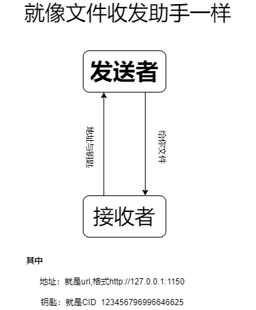
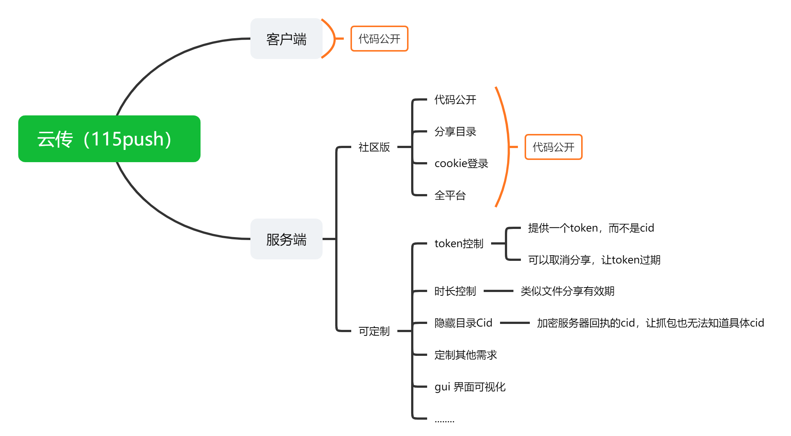

欢迎来到115云传（115push）,顾名思义这是一个115网盘的辅助工具，可以将网盘的内容拷贝到115网盘中，而不是下载后再上传。  
本项目只能用于**测试**，并非开源项目，请勿用于商业用途，请勿修改后拿去卖钱！！！

## 项目原理

## 服务端/分享者
* 登录  
将EditThisCookie格式的cookie粘贴到cookies.txt中  
cookies.txt 就在旁边，你也可以手动新建。
* 启动服务  
方式1：双击运行软件 选择 `1 启动服务端，其他人将通过您提供的链接访问你的115资源`  
方式2：使用 ./115push_xxx_xxx `-s` 运行
* 分享你的url及cid  
url地址采用这种格式：  http://`ip`:1150  
cid就是网址中红色的部分：https://115.com/?cid=1394354360170597585&offset=0&mode=wangpan  
---
### 客户端/接受者
* 登录  
  将EditThisCookie格式的cookie粘贴到cookies.txt中  
  cookies.txt 就在旁边，你也可以手动新建。
* 运行软件后选择 `2 启动导入，通过输入他人提供的服务端地址，导入115资源`  
* 输入自己的CID，可以是`0`
* 输入分享者提供的url 保持 http://`ip`:端口 格式
* 输入分享者提供的CID。
---
说到最后：  
这个项目不是一个开源项目，我不想因此而承担各种责任，如果你想将软件运用于商业项目，或者拿来卖钱，修改，植入病毒，或者盈利，产生的后果与本人无关。  
如果想使用定制功能，或者付费咨询，可以联系`admin@shaoxia.xyz`,**定制功能与付费咨询也同样只能用于测试**。
